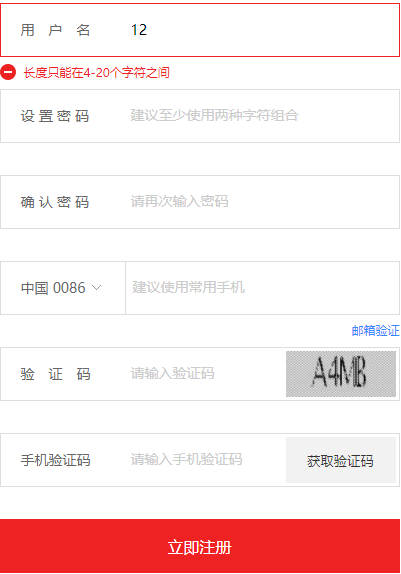
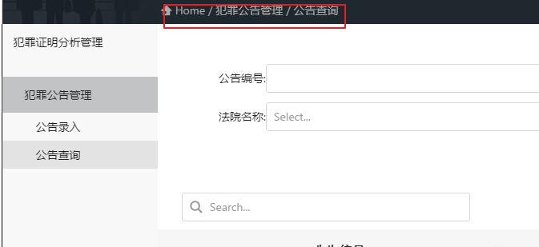

# UI交互规范
作为前端工程师，开发出来的成果要直接面向公众用户的，对UI展示的一些细节必须做到精益求精。因此在一个前端工程开发之前，我们先要定义好前端UI交互相关规范。

## 1. UI-表单元素校验
### 1.1 表单样式
表单样式应该统一，表单元素高度，长度，背景颜色，提示框颜色，图标，功能按钮位置等。

### 1.2 文本框
1. 必填文本框：针对必填文本框，在第一次输入后，鼠标移开需要验证，并且给出正确的提示信息。

2. 文本框类型：针对只能填写数字、字符、手机号、邮编、邮箱、证件号码、经纬度等，在第一次输入后，鼠标移开需要验证，并且给出正确的提示信息。

3. 文本框输入范围限制字符个数: 如只能输入10个字符，在第一次输入10后，文本框不能再输入其它任何东西，在输入过程中给出小提示，最多只能输入多少个字符，输入完成需要进行验证，如果不符合，需要给出正确的提示。

4. 文本框输入范围限制只能输入数字(数字从1~99):在进行文本框输入时不能输入字符信息，在输入过程中给出小提示，输入的数值范围是多少，输入完成需要进行验证，如果不符合，需要给出正确的提示。

5. 文本框输入范围限制只能输入字符:同4

### 1.3 文本域
1. 文本域字数限制，文本域需要有输入字符个数限制，超过不能再输入，输入过程中，需要实时显示当前共输入了多少字符。

2. 文本域样式,文本域空间不能出现`左右滚动条`，不能显示边框

### 1.4 时间控件
1. 时间选择，时间选择要求开始时间的选择范围要早于结束时间，结束时间的选择范围要晚于开始时间。
2. 时间控件需要设置最大时间范围，最小时间范围(当前时间+-100年)

### 1.5 表单提交按钮
1. 表单某些元素验证不通过,提交表单时，如果某些元素验证不通过，保存不成功，不弹对话框，验证失败的UI元素应高亮显示，并且提升验证失败相关信息。

2. 表单提交成功,表单提交成功后，应该跳转到对应的列表，并且在对应的列表中能迅速找到刚才添加的数据

3. 表单提交失败，如果表单提交失败，应该跳转到一个统一的系统错误页。

## 2. UI-列表页面相关元素
### 2.1 列表样式
列表页面样式应该统一，查询，修改，删除，批量删除等功能按钮位置样式，图标，列表样式等

### 2.2 删除按钮
1. 删除前确认提示，在删除记录前需要有确认提示。

2. 删除成功,删除成功应该弹出系统统一提示框

3. 删除失败，删除失败，应该弹出统一提示框，框里面应该有删除失败原因

### 2.3 查询按钮
1. 输入框查询字符处理，在输入框输入一些特殊字符，如字符前后带有多个空格字符串，后台查询需要Trim()处理

2. 高级查询条件，高级查询条件默认应该隐藏，在有需要的时候，点击高级查询，弹出高级查询条件选择窗口。

### 2.4 列表展示
1. 列表样式，所有列表样式应该保持一致，并且列表不能有横向，纵向滚动条。

2. 列表没有数据时显示，当列表没有数据时，应该默认显示没有记录！

3. 列表分页，列表使用分页，每页的记录都应该保持一致，如10条，特殊情况除外

4. 海量数据列表展示，如果某个业务有上千万条数据，列表的展示，需要限制查询时间区间，如查询时间区间不能超出一个月。

5. 列表单元格元素超长展示，列表单元格元素过长，只显示【部分+“...”】，当鼠标移动到该字符时，使用Tooltip将内容全部显示出来

6. 列表显示可量化数据时，列头需要显示单位

### 2.5 刷新按钮
1. 列表刷新按钮样式 样式应该统一
2. 列表刷新按钮点击时，不能操作列表任何元素，数据查询过慢，上面需要遮罩层。
3. 刷新按钮每次查询的条件应该自带列表上方查询元素条件。

## 3. 附件相关
### 3.1 上传附件
1. 附件大小，单个附件最大上传为5M，超过大小应该给予提示
2. 一次上传附件个数，一次只能上传10个附件，超过个数应该给予提示，超过上传总大小50M，应该给予提示
3. 附件格式：可上传格式为"png",  "jpg",  "jpeg",  "bmp"、可预览和单个删除。

### 3.2 附件列表
1. 附件列表显示：附件列表显示：附件名称、上传的附件类型、附件大小、附件上传时间以及操作（预览、删除）
2. 附件列表样式： 附件列表总体样式应该与噗列表样式保持一致

## 4. ui-站点导航
1. 站点导航样式，所有站点导航样式应该保持一致，显示位置应该在当前页面上方

2. 站点导航，每个内置导航页面都应该有站点导航
3. 导航菜单每次点击时应该具有刷新效果？

## 5. ui-弹出框
### 5.1 表单弹出框
1. 表单弹出框样式：表单弹出框应该是模态框，样式需要保持一致
2. 表单弹出框需要有关闭按钮

### 5.2 系统确认信息弹出框
1. 系统确认信息弹出框，包含确认，取消两个按钮，里面的信息根据业务不同信息不同。

### 5.3 系统消息提示框
1. 系统消息提示框应该是一个非模态框，不需要主动去关闭，在一定时间后，如7秒回自定关闭。
2. 系统消息提示框位置应该在页面的右下角。

## 6. ui-统一错误页
每个子系统应该有一个统一错误页，当网络原因，服务器内部错误，服务器维护(服务器返回400，500错误时)，统一跳转到错误页

## 7. ui-页头

## 8. ui-页脚

