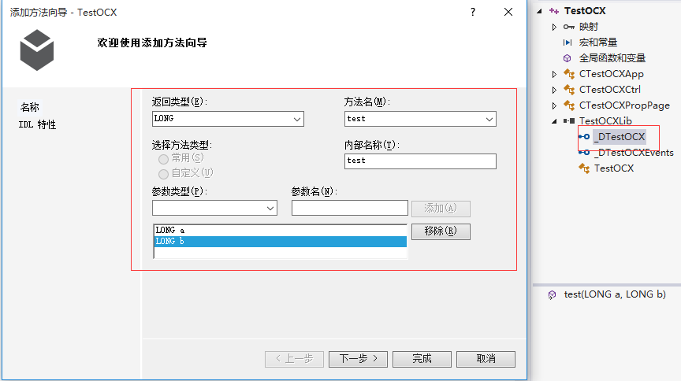
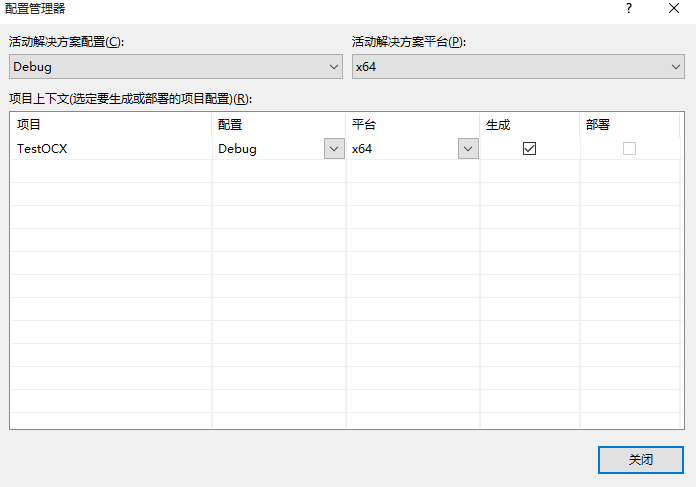
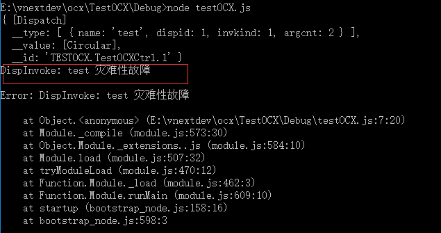

# node-activex实践方案
这里是在nodejs里调用activex的实践示例。

## 1. 环境准备
1. node开发环境 v8.4.0
2. c++开发环境  vs2012
3. 平台支撑：win10企业版 x64
4. python2.7

## 2. 安装winax
在node环境中集成activex主要使用的插件是winax([什么是winax?](https://www.npmjs.com/package/winax))。

在使用npm安装winax之前我们需要准备好node-gyp编译环境，因为winax是一个原生的node模块，在不能版本的node环境中使用，首先需要对它进行编译。

node-gyp编译环境：
1. python2.7
2. vsexpress

还一种简单方法（前提是需要连接外网），在管理员账户下执行:
```
npm install --g --production windows-build-tools
```
会自动安装node-gyp编译环境。

编译环境准备好后，先执行
```
npm install -g node-gyp
```
在我指定开发目录执行
```
npm install winax
```


## 2. 编写ocx
直接使用MFC ActiveX控件向导创建一个简单ocx。


切换到类视图，添加一个简单对外方法test



编译成功后！在开始菜单中以管理员的账户运行cmd，执行OCX的注册
```
regsvr32 testOCX.ocx
```
```
regsvr32 testOCX.ocx /u  //反注册
```

这里有两个需要注意的地方：
1. 注意运行平台，一个修改成x64



2. activeX默认对外的API IsInvokeAllowed是false，导致在nodejs中调用ocx的接口时，出现灾难性故障的问题。

解决方案如下，在TestOCXCtrl.cpp中重写IsInvokeAllowed方法，代码如下，
```
BOOL CTestOCXCtrl::IsInvokeAllowed (DISPID)
{
	return true;
}
```
到此ocx编写完成。[源码地址]()

## 2. 编写调用ocx的js文件
具体实现调用ocx的js代码如下，
```
require('winax');
var testOCX = new ActiveXObject("TESTOCX.TestOCXCtrl.1");
var result = 'ok';
try{
	var result = testOCX.test(1,2);
	console.log(result);
} catch(ex){
    result = ex.message;
	console.log(result);
}
```
node-activex实践方案到此结束。
